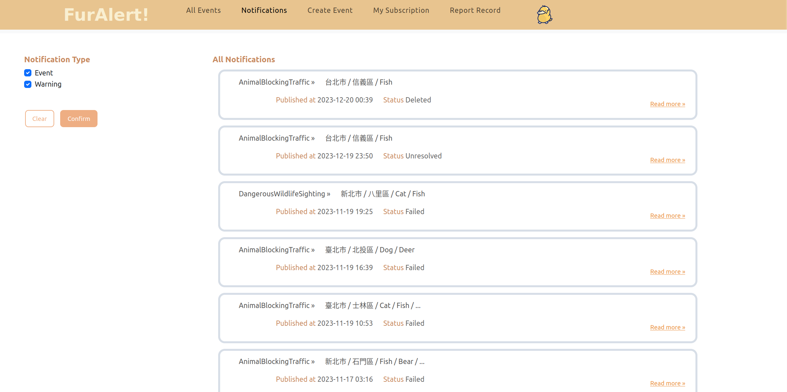

# FurAlert!

## Introduction

「FurAlert!」是由民眾與動保救助單位協力共創的動物救助系統，當民眾遇到動物受傷或相關事件，可以透過系統立即通報救助單位尋求協助，或藉由系統通知掌握事件消息。系統致力於提供即時的動物救助服務，促進社區動物與民眾的安全。

<figure>

<figcaption>Notification Page</figcaption>
</figure>

## Install PostgreSQL

This project uses PostgreSQL, preferably 15.5 or up.

## Backup Existing Database

First, create a new database with the name `furalert`.

Then in the root directory, run the following to restore our existing database:
Here we assume the username is postgres.

```
pg_restore -h localhost -p 5432 -U postgres -v -Fc sql/furalert_db_backup.sql --schema=public -d furalert
```

## Dependencies

The `backend` directory will be where we run everything from.

`cd backend`

1. We initialize a python virtual environment and activate it:

```
virtualenv venv

source venv/bin/activate

pip install -r requirements.txt
```

## Run Application

### Database URL Configuration

In `./backend/schema/database.py`, we have define our database configurations, such as username, password. Make the changes necessary to the config to access the database we just restored.

Here we assume the username and password are both the default value `postgres`.

### Run Scripts

`cd backend`

Open 3 terminals and run each of the following scripts in one of the terminals:

```
# terminal 1
./run-flask.sh

# terminal 2
./run-celery.sh

# terminal 3
./run-redis.sh
```

- `run-flask.sh`: the flask application
- `run-celery.sh`: the celery worker that sends out our notifications. Since notification insertion may take up a lot of time, we separate it to a background process to prevent lagging for the event reporter.
- `run-redis.sh`: acts as the broker for celery worker

Note that `run-redis.sh` has some additional dependencies(ex. `curl`, `tar`), since it compiles the stable version of redis on our machine. Make sure to install them when encountering any errors.

## Test Application

For testing purposes, we have created a number of accounts.

The following accounts all use the password `1234`.

### User Accounts
- josephine9403@gmail.com
- george8898@gmail.com
- nathaniel6882@gmail.com
- nu6e19eqri5@gmail.com

### Responder Accounts
- do0rh78al3@gmail.com
- i4navg547rii@gmail.com
- cl3of74ner7e@gmail.com
- 127ifn9ejern@gmail.com

### Admin Accounts
- testadmin@gmail.com
- testadmin2@gmail.com
